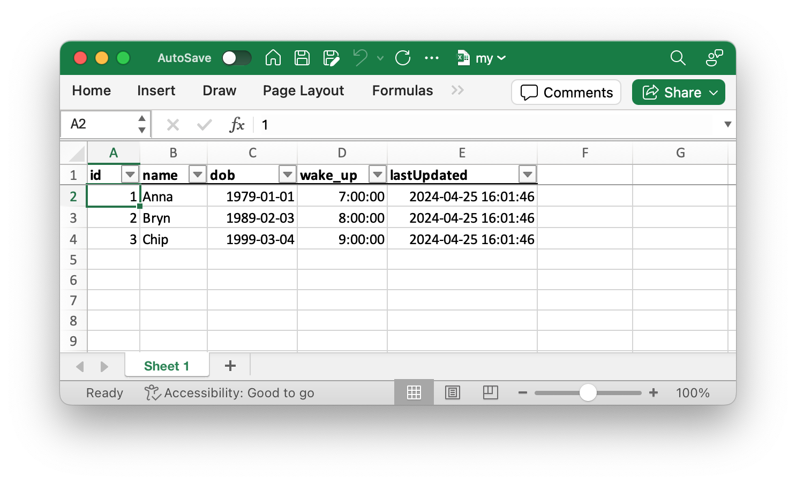

# xlsxtable

A small, simple library to create nice `.xlsx` Excel files from tabular data, which:

* Emboldens and (optionally) freezes and autofilters the headings
* Sets column widths based on cell content
* Converts dates and times to native Excel format (roughly: floating-point days since 0 Jan 1900)
* Works everywhere, including Node and browsers

Size: under 7KB gzipped. The only runtime dependency is [littlezipper](https://github.com/jawj/littlezipper) (which is by the same author, tiny, and has no runtime dependencies of its own).

This library [powers `.xlsx` download in the Neon SQL Editor](https://neon.tech/blog/export-to-csv-json-and-xlsx-from-the-neon-console).


## How do you say _xlsxtable_?

Pronunciation rhymes with [Hextable](https://en.wikipedia.org/wiki/Hextable), or is similar to vegetable. That is: _ex-el-ess-EX-tuh-bl_.


## Types

Types are defined on a per-column basis. The library supports Excel numbers, strings, dates/times, and empty cells.

Excel has no concept of time zones, so the date and time types have local and UTC variants. The local variants produce a date or time that's the same as the one you get from `date.toString()` (minus the local timezone information, and formatted differently). The UTC variants produce a date or time that's the same as the one shown by `date.toISOString()` (minus the `Z`, and formatted differently).

* For `XlsxTypes.String` columns, cell values will be coerced to `string`.
* For `XlsxTypes.Number` columns, cell values must be provided as either `number` or (numeric) `string`.
* For `XlsxTypes.LocalDate`, `XlsxTypes.UTCDate`, `XlsxTypes.LocalTime`, `XlsxTypes.UTCTime`, `XlsxTypes.LocalDateTime` and `XlsxTypes.UTCDateTime` columns, cell values should be provided as `Date` objects, with `string` as a fallback (e.g. if the date is infinite, or before 1900, or otherwise unsupported by Excel).
* For all column types, `null` or `undefined` cell values result in an empty cell.


## Example usage

To write an `.xlsx` file in Node:

```javascript
import { createXlsx, XlsxTypes as Xl } from 'xlsxtable';
import { writeFileSync } from 'fs';

const now = new Date();

createXlsx({
  // sheet data
  headings: ['id', 'name', 'dob', 'wake_up', 'lastUpdated'],
  types: [Xl.Number, Xl.String, Xl.LocalDate, Xl.LocalTime, Xl.LocalDateTime],
  data: [
    [1, 'Anna', new Date(1979, 0, 1), new Date(0, 0, 0, 7), now],
    [2, 'Bryn', new Date(1989, 1, 2), new Date(0, 0, 0, 8), now],
    [3, 'Chip', new Date(1999, 2, 3), new Date(0, 0, 0, 9), now],
  ],
  // options
  sheetName: 'Sheet 1',  // shown on the tab at the bottom: limited character range allowed
  freeze: true,          // freeze the top/header row
  autoFilter: true,      // enable autofilter for headers
  wrapText: true,        // wrap long text cells
  // metadata
  creator: 'Diane', 
  title: 'Blughupsnitch data',
  description: 'Data about the blughupsnitch',
  company: 'Dogoodnever Inc.',
})
  .then(xlsx => writeFileSync('/path/to/my.xlsx', xlsx));
```

This produces [`my.xlsx`](my.xlsx):



To provide a download in browsers, something like this works well:

```javascript
const xlsx = await createXlsx(/* ... */);

const url = URL.createObjectURL(new Blob([xlsx]));
const link = document.createElement('a');
link.style.display = 'none';
document.body.appendChild(link);
link.href = url;
link.download = 'my.xlsx';
link.click();
setTimeout(() => {
  URL.revokeObjectURL(url);
  document.body.removeChild(link);
}, 0);
```

## License

[MIT licensed](LICENSE).
